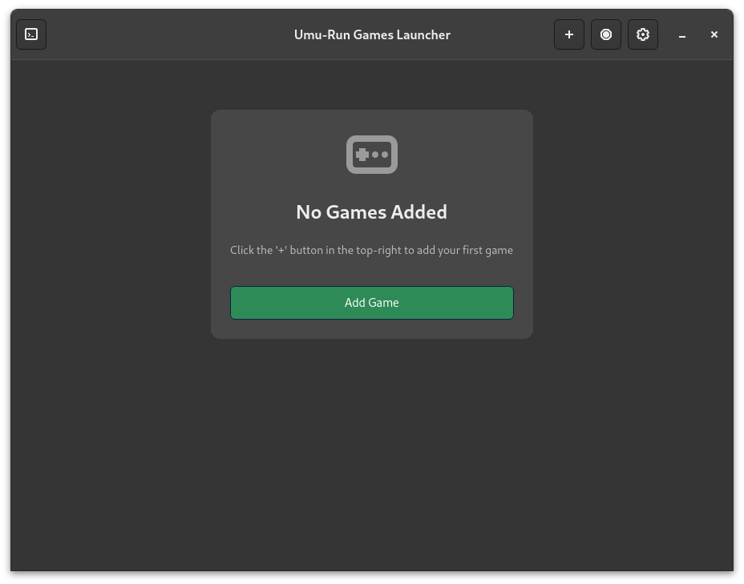
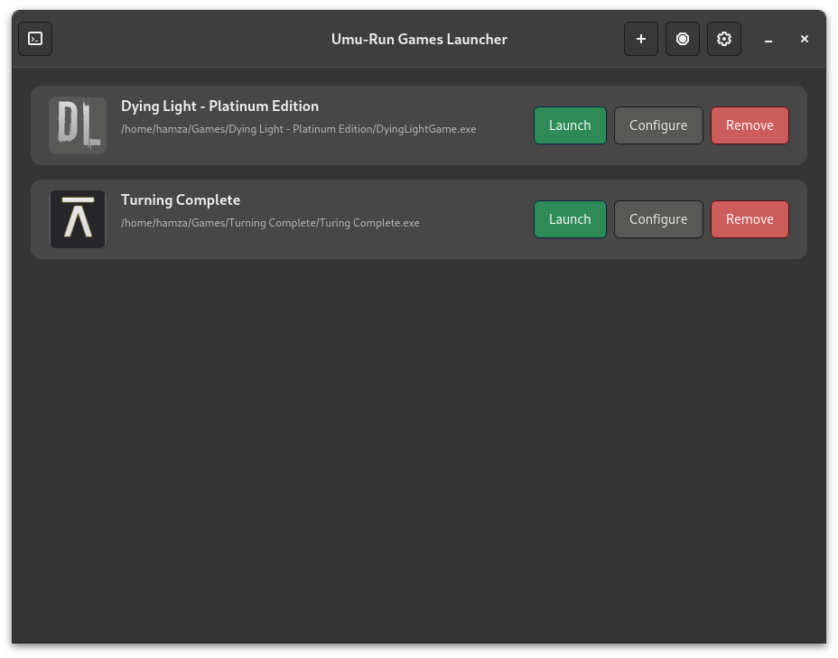
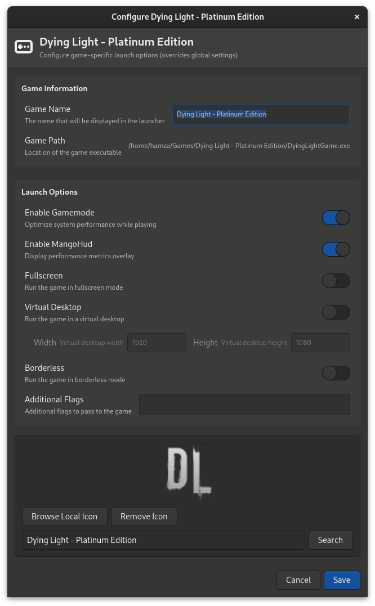
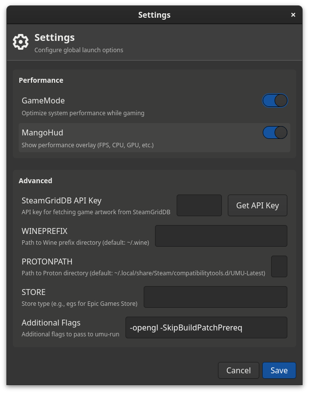

# Umu-Run Games Launcher

A GTK-based game launcher for managing and running Windows games on Linux using umu-run.



## Features

- Clean and modern GTK 4.0 interface
- Configurable launch options
- GameMode and MangoHud integration
- Intuitive drag and drop interface:
  - Add games by dropping .exe files
  - Reorder games by dragging and dropping

## Game Management



### Game Configuration



## Requirements

- Python 3.8+
- GTK 4.0
- umu-run
- Optional: GameMode, MangoHud

## Installation

1. Install the required dependencies:
```bash
pip install -r requirements.txt
```

2. Make sure you have umu-run installed on your system.

## Usage

Run the launcher:
```bash
python3 main.py

# Verbose mode (shows debug logs)
python3 main.py -v

# Quiet mode (shows only errors)
python3 main.py -q

# Suppress graphics driver warnings
python3 main.py -q 2>/dev/null

# Launch specific game
python3 main.py --launch /path/to/game.exe
```

## Configuration

The launcher can be configured through the settings dialog:



Options include:
- Performance options (GameMode, MangoHud)
- Additional launch options
