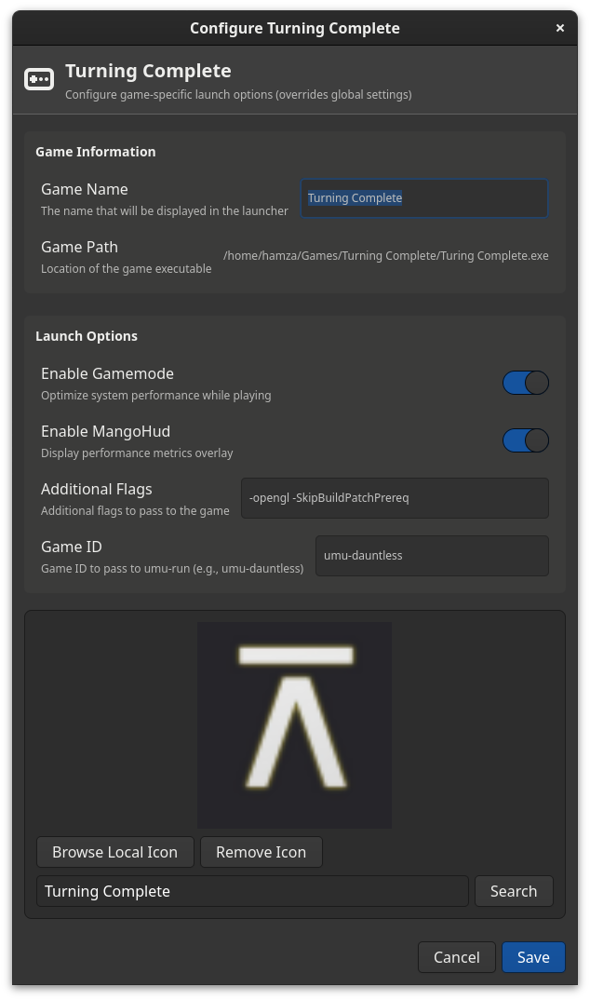

# UMU-Run GUI Launcher

A GTK4-based graphical frontend for umu-run, making it easier to manage and launch Windows games on Linux.

Created this project with Windsurf (i have no clue how it works) to make it easier to manage my Windows games on Linux.


## Features

- Clean and modern GTK 4.0 interface
- Support for Windows executables (32-bit and 64-bit)
- GameMode and MangoHud integration
- Virtual desktop support
- SteamGridDB integration for game icons
- Borderless window mode support

## Screenshots

### Game List


### Game Configuration


### Settings


## Requirements

- Python 3.8+
- GTK 4.0
- umu-run
- Optional: GameMode, MangoHud
- Optional: SteamGridDB API key for icon fetching

## Installation

### Method 1: From Source

1. Install the required dependencies:
```bash
pip install -r requirements.txt
```

2. Make sure you have umu-run installed on your system.

3. Run the launcher:
```bash
python3 main.py
```

## Configuration

The launcher stores its configuration in `~/.config/umu-launcher/config.json`.

## License

This project is open source and available under the MIT License.
